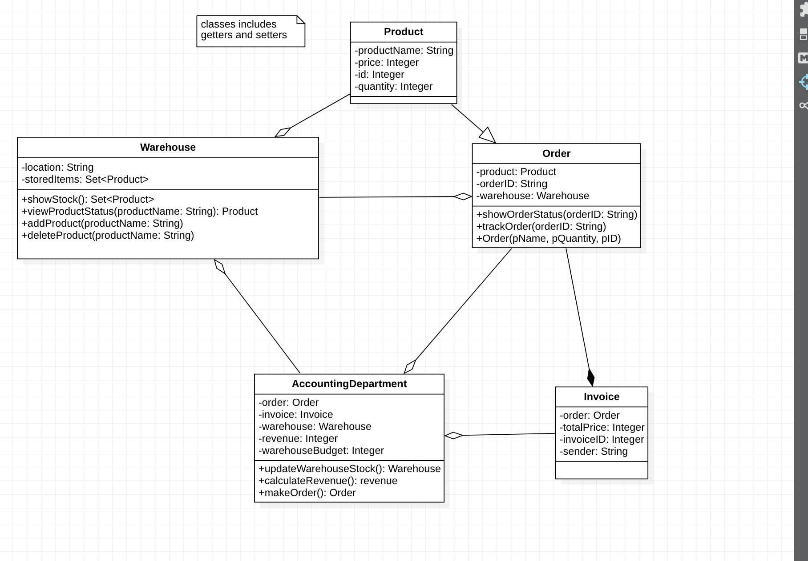

Task 7 - Decompose Warehouse
    Analyze and decompose Warehouse (create UML class diagram for application).
    The user of your application will be a Warehouse manager.
    Analyze main parts and functions of Warehouse.
    Add png image to the separate gitlab project.

DESCRIPTION:

The employee is an integral part of the warehouse.
Manager - a person who makes orders, accepts invoices and can make changes to the quantity of goods based on the invoice or in any other cases.
An invoice cannot exist without an order, and the order is a list of products.
Goods are stored in the warehouse